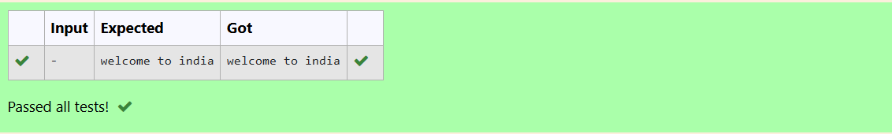
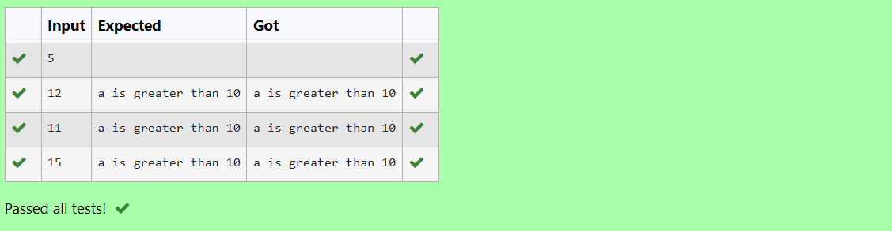
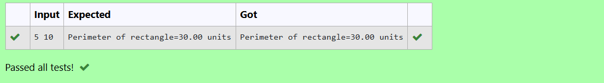
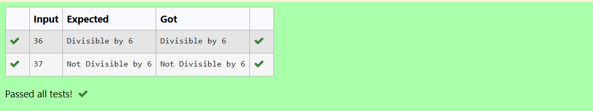
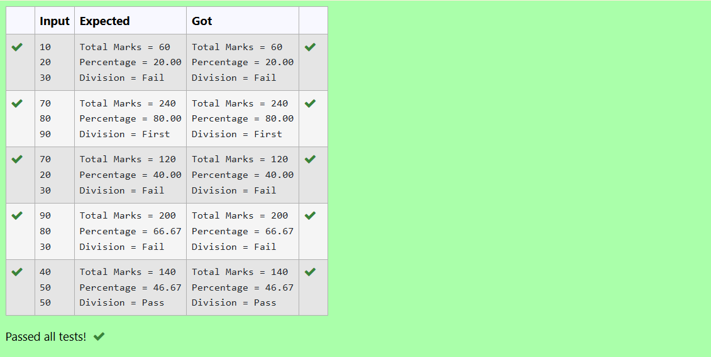

# EX-01-Datatypes-Operators
## AIM:
Write a program to print welcome to india

## ALGORITHM:
1.	Declare a variable (optional, since we are only printing text).
2.  Display the message "Welcome to India" using the printf function.
3.	End the program.

## PROGRAM:
~~~
#include <stdio.h>
int main()
{
    printf("welcome to india");
    return 0;
}
~~~
## OUTPUT:

## RESULT:
Thus the program successfully displays the message “Welcome to India” on the screen.

# EX-02- Conditional-Statements
## AIM:
Write a C program to read A values and check whether  A > 10. 

# ALGORITHM:
1. Declare an integer variable A.
2. Read the value of A from the user using scanf().
3. Check whether A > 10 using an if condition.
4. If true, print “A is greater than 10”.
5. Otherwise, print “A is not greater than 10”.
6. End the program.

# PROGRAM:
~~~
#include <stdio.h>
int main()
{
    int A;
    scanf("%d",&A);
    if(A>10)
    {
        printf("a is greater than 10");
    }
    
 return 0;   
}
~~~
# OUTPUT:

# RESULT:
Thus the program successfully reads a value and checks whether it is greater than 10 or not.
 
# EX-03- Operators-Expressions
## AIM:
Write a C program to find the perimeter of the rectangle.

## ALGORITHM:
1. Declare two variables: length and breadth.
2. Read the values of length and breadth from the user using scanf().
3. Calculate the perimeter using the formula:
                           Perimeter=2×(length+breadth)
4. Display the result using printf().
5. End the program.

## PROGRAM:
~~~
#include <stdio.h>

int main() {
    float length, breadth, perimeter;

    // Input
    scanf("%f %f", &length, &breadth);

    // Calculate perimeter
    perimeter = 2 * (length + breadth);

    // Output
    printf("Perimeter of rectangle=%.2f units\n", perimeter);

    return 0;
}
~~~

## OUTPUT:

## RESULT:
Thus the program successfully calculates and displays the perimeter of the rectangle.

# EX-04- Using Conditional Statements

## AIM:
Write a C program to read a number and check whether the number is divisible by 6 or not using  if else

## ALGORITHM:
1. Declare an integer variable num.
2. Read the number from the user using scanf().
3. Check whether the number is divisible by 6 using the condition
                                \text{if (num % 6 == 0)}

4. If true, print “Number is divisible by 6”.
5. Otherwise, print “Number is not divisible by 6”.
6. End the program.

## PROGRAM:
~~~
#include<stdio.h>
int main()
{
    int num;
    scanf("%d",&num);
    if (num%6==0)
    {
        printf("Divisible by 6");
    }
    else
    {
        printf("Not Divisible by 6");
    }
    return 0;
}
~~~
## OUTPUT:

	

## RESULT:
Thus the program successfully reads a number and checks whether it is divisible by 6 or not using an if-else statement.

# EX-05- Calculating Total, Percentage, And Division Using Conditional Statements 

## AIM:
To write a C program that reads marks of three subjects, calculates the total and percentage, and then determines the division (First, Second, Pass, or Fail) based on the percentage and minimum marks criteria.

## ALGORITHM:
1.	Start
2.	Declare integer variables mark1, mark2, mark3 for marks,total and float 
    variable percentage.          
3.	Input the marks for three subjects.
4.	Calculate total marks: total = mark1 + mark2 + mark3
5.	Calculate percentage: percentage = total / 3
6.	Display total and percentage.
7.	Check if all marks are greater than or equal to 40:
8.	If yes:
a.	If percentage >= 60: Print “Division = First”
b.	Else if percentage >= 48: Print “Division = Second”
c.	Else if percentage >= 36: Print “Division = Pass”
9.	Else: Print “Division = Fail”
10.	End
## PROGRAM:
~~~
#include <stdio.h>
int main()  
{
    int mark1,mark2,mark3,total;
    float percentage;
    scanf("%d%d%d",&mark1,&mark2,&mark3);
    total=mark1+mark2+mark3;
    percentage=(total/300.0)*100;
    printf("Total Marks = %d\n",total);
    printf("Percentage = %.2f\n",percentage);
    if(mark1<40||mark2<40||mark3<40)
    {
        printf("Division = Fail");
        return 1;
    }
    
    if(percentage>=60)
    {
        printf("Division = First");
    }
    else if(percentage<60 && percentage>=48)
    {
        printf("Division = Second");
    }
    else if(percentage<48 && percentage>=36)
    {
        printf("Division = Pass");
    }
    else
    {
        printf("Division = Fail");
    }
    return 0;
}
~~~
## OUTPUT:

## RESULT:
The program successfully takes three subject marks, calculates the total and percentage, and correctly determines the division based on predefined grading logic.

